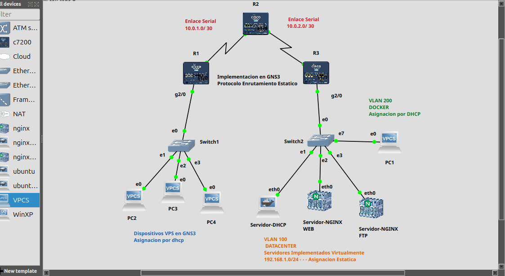

Markdown
## GNS3 - VLANs y DHCP Relay
Lab GNS3 con Router-on-a-Stick...



Lab GNS3 con Router-on-a-Stick. 2 VLANs sobre trunk dot1q: VLAN 100 (192.168.1.0/24) para servidores con DHCP en 192.168.1.10 y VLAN 200 (192.168.2.0/24) para clientes. Usa ip helper-address para dar DHCP entre VLANs.

## CONFIGURACION-ROUTERS

## Router R3 - Router-on-a-Stick
Este es el que hace toda la chamba.

Encendimos la interfaz física Gig0/0 con no shutdown
Creamos 2 subinterfaces:
E0/0.100 -> VLAN 100 Servidores
E0/0.200 -> VLAN 200 Clientes
A cada una le pusimos encapsulation dot1Q [vlan]
Le asignamos IP:
192.168.1.1 /24 para la VLAN 100
192.168.2.1 /24 para la VLAN 200
Lo más importante: En la subinterfaz de clientes (200) le metimos el ip helper-address 192.168.1.10 para que reenvíe las peticiones DHCP al servidor que está en la otra VLAN.
Con eso el router rutea entre VLANs y hace de intermediario DHCP.
## Configuración Realizada
### Router R3 (Router-on-a-Stick)

| Subinterfaz | VLAN | IP | Función |
|---|---|---|---|
| E0/0 | - | no IP | Trunk físico hacia el switch |
| E0/0.100 | 100 | 192.168.1.1/24 | Gateway de Servidores |
| E0/0.200 | 200 | 192.168.2.1/24 | Gateway de Clientes + DHCP Relay |

```RT-03
conf t
 hostname RT-03
 interface Se1/1
  ip address 10.0.2.2 255.255.255.252
  clock rate 64000
  no shutdown
  exit
 interface Gig2/0.100
  encapsulation dot1Q 100
  ip address 192.168.1.1 255.255.255.0
  no shutdown
  exit
 interface Gig2/0.200
  encapsulation dot1Q 200
  ip address 192.168.2.1 255.255.255.0
  ip helper-address 192.168.1.10
  no shutdown
  exit
 ip route 192.168.3.0 255.255.255.0 10.0.2.1
 exit
 copy running-config startup-config
```
